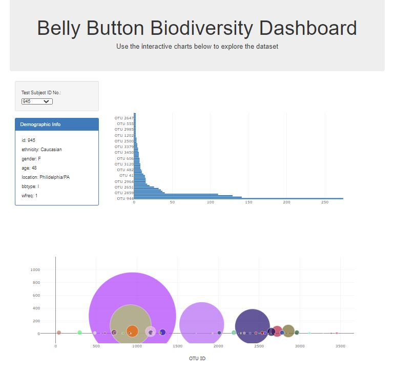

# Interactive-Dashboard-Challenge

In this assignment, I will build an interactive dashboard to explore the [Belly Button Biodiversity dataset](http://robdunnlab.com/projects/belly-button-biodiversity/), which catalogs the microbes that colonize human navels. 

The dataset reveals that a small handful of microbial species (also called operational taxonomic units, or OTUs, in the study) were present in more than 70% of people, while the rest were relatively rare.

## About the Process:

Used the D3 library to read in the sample JSON data. Used Plotly to create dashboard visualizations and used D3 library to make said visuals interactive based on selected test subject ID number. Created and designed webpage for interactive dashboard. Deployed my app to free static page hosting service. [Click here]( https://alexandraoricchio.github.io/Interactive-Dashboard-Challenge/) to deploy my app! 

---

#### About the Data
Hulcr, J. et al.(2012) A Jungle in There: Bacteria in Belly Buttons are Highly Diverse, but Predictable. Retrieved from: 

http://robdunnlab.com/projects/belly-button-biodiversity/results-and-data/
